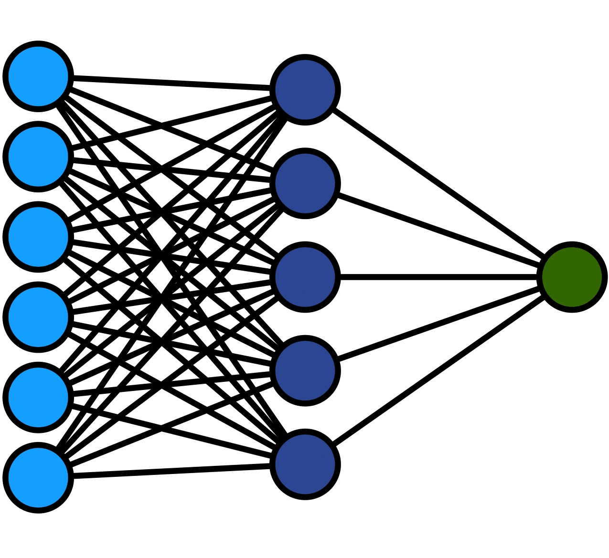
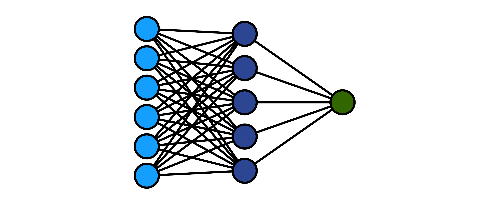
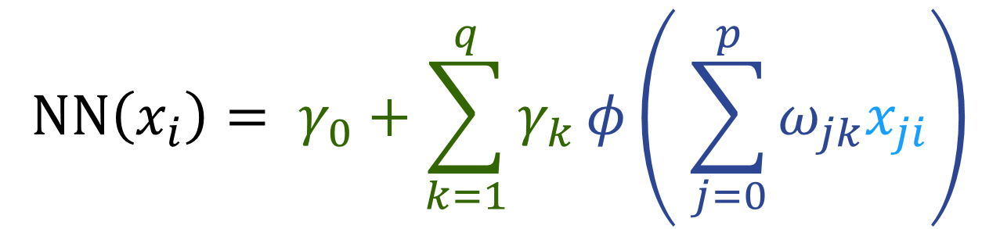
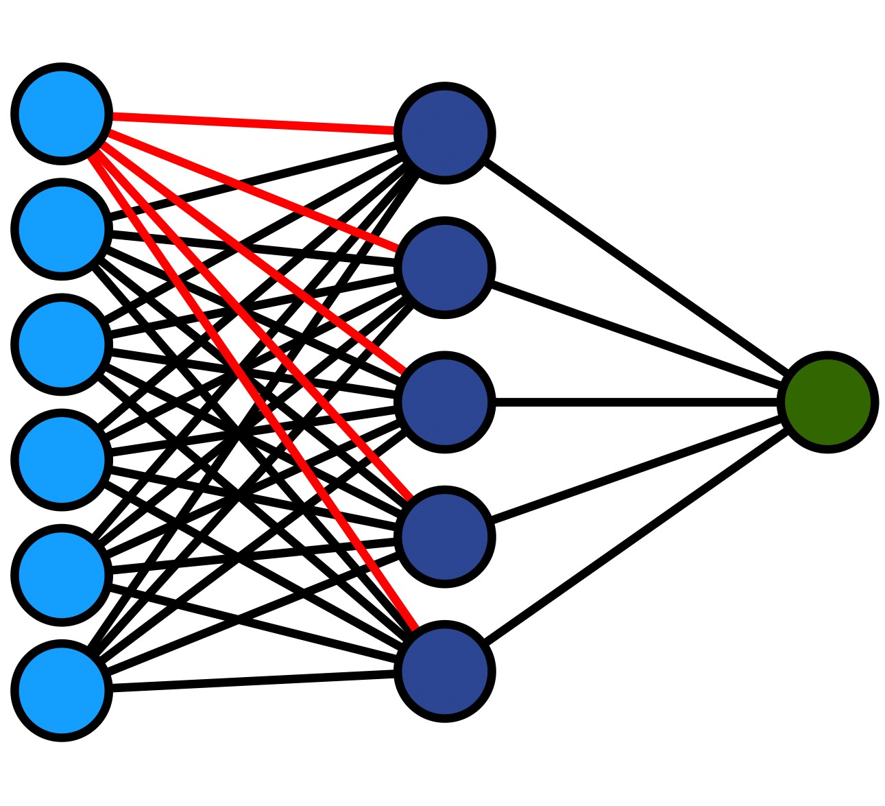
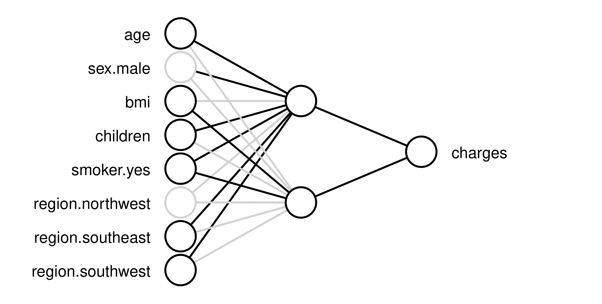
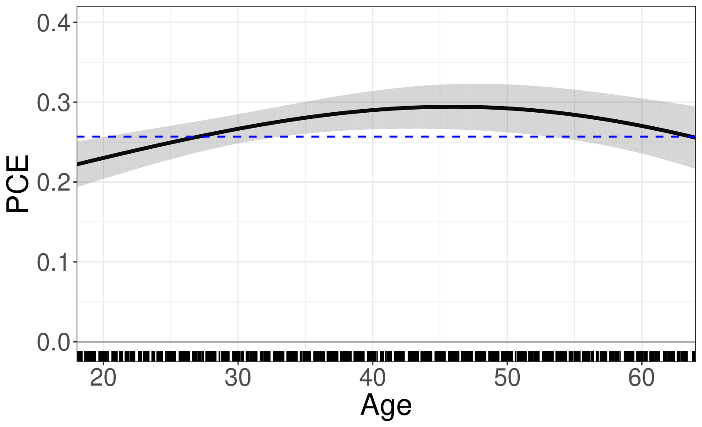
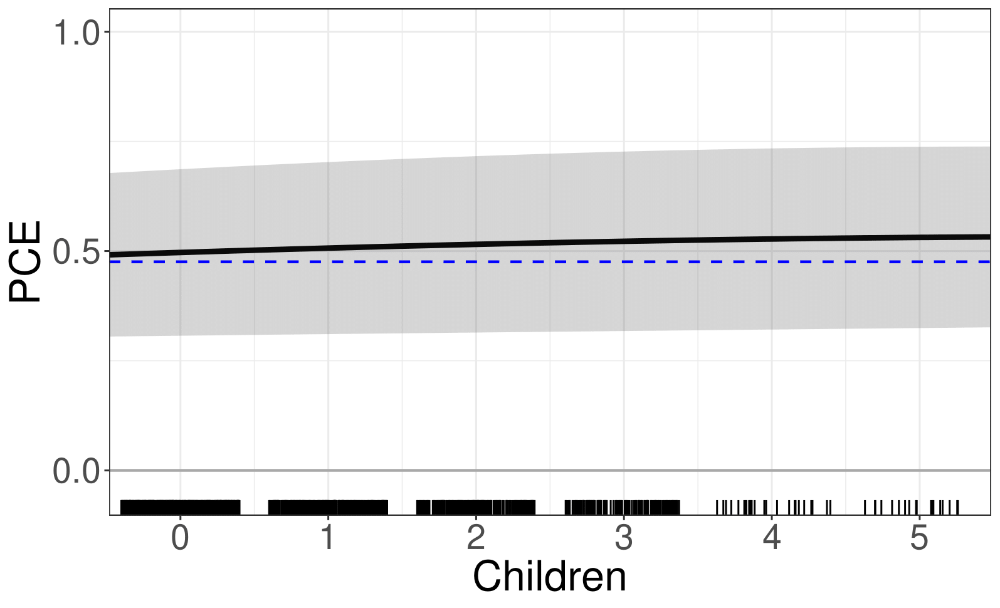

```{r, echo=FALSE, message=FALSE}
library(knitr)
library(fontawesome)
# the default output hook
hook_output <- knit_hooks$get('output')
knit_hooks$set(output = function(x, options) {
  if (!is.null(n <- options$out.lines)) {
    n <- as.numeric(n)
    x <- unlist(stringr::str_split(x, "\n"))
    nx <- length(x) 
    x <- x[pmin(n,nx)]
    if(min(n) > 1)  
      x <- c(paste(options$comment, "[...]"), x)
    if(max(n) < nx) 
      x <- c(x, paste(options$comment, "[...]"))
    x <- paste(c(x, "\n"), collapse = "\n")
  }
  hook_output(x, options)
    })
```

```{r, echo = FALSE}
library(interpretnn)
```


```{r analysis, include=FALSE, cache=TRUE}

# load packages -----------------------------------------------------------
library(interpretnn)
library(caret)
library(selectnn)

set.seed(1)

# load data ---------------------------------------------------------------
insurance <- read.csv("insurance.csv",
                      stringsAsFactors = TRUE)

dummy <- dummyVars(" ~ .", data = insurance)
insurance <- data.frame(predict(dummy, newdata = insurance)) 


# prep data --------------------------------------------------------

std_X <- caret::preProcess(insurance[, c(1, 4, 5)])

std_y <- caret::preProcess(data.frame("charges" = insurance[, 12]))

X <- as.matrix(predict(std_X, insurance[, c(1, 4, 5)]))
X <- cbind(X, insurance[, c(3, 7, 9:11)])
X <- X[, c(1, 4, 2, 3, 5, 6:8)]
y <- as.matrix(predict(std_y, data.frame("charges" = insurance[, 12])))
df <- as.data.frame(cbind(X, y))

# selectnn ----------------------------------------------------------------
set.seed(2)
nn <- selectnn(charges ~ ., data = df, Q = 8, n_init = 5)
summary(nn)


interpretnn.default <- function(object, B = 100, ...) {
  
  stnn <- interpretnn(object$nn, X = object$x, y = object$y, B = B)
  
  return(stnn)
}

# interpretnn -------------------------------------------------------------

n_init <- 10
q <- 2 # achieves VC that is positive definite

lambda <- 0.1


inn <- nn_fit(X, y, q, n_init, maxit = 2000, lambda = lambda)

intnn <- interpretnn.default(inn)

summary(intnn, wald_single_par = TRUE)
```

class: title-slide, left, bottom

# `r rmarkdown::metadata$title`
----
## **`r rmarkdown::metadata$author`**, **`r rmarkdown::metadata$coauthor`**
### `r rmarkdown::metadata$institution`
#### `r rmarkdown::metadata$event`, `r rmarkdown::metadata$date`


---


# Feedforward Neural Networks 

--

.left-column[
```{r, echo=FALSE, out.width="100%", fig.align="center"}

```
]

<!-- 
<!--      width="800px" height="350px" -->
<!--      style="position:absolute; right:500px; top:220px;"> -->

<br>


--

.right-column[ 
```{r, echo=FALSE, out.width="95%", out.height="100%", fig.align="right"}
knitr::include_graphics("img/nneq1.png")
```  
]

---
count: false
# Feedforward Neural Networks 


.left-column[
```{r, echo=FALSE, out.width="100%", fig.align="center"}

```
]

<br>


.right-column[ 
```{r, echo=FALSE, out.width="95%", out.height="100%", fig.align="right"}

```  
]

---
count: false
# Feedforward Neural Networks 


.left-column[
```{r, echo=FALSE, out.width="100%", fig.align="center"}

```
]

<br>


.right-column[ 
```{r, echo=FALSE, out.width="95%", out.height="100%", fig.align="right"}
knitr::include_graphics("img/nneq3.png")
```  
]

---
count: false
# Feedforward Neural Networks 


.left-column[
```{r, echo=FALSE, out.width="100%", fig.align="center"}

```
]

<br>


.right-column[ 
```{r, echo=FALSE, out.width="95%", out.height="100%", fig.align="right"}
knitr::include_graphics("img/nneq4.png")
```  
]

---
count: false
# Feedforward Neural Networks 


.left-column[
```{r, echo=FALSE, out.width="100%", fig.align="center"}

```
]

<br>


.right-column[ 
```{r, echo=FALSE, out.width="95%", out.height="100%", fig.align="right"}

```  
]


---
# Data Application 

--

### Insurance Data (Kaggle)

--

1,338 beneficiaries enrolled in an insurance plan  

--

 
Response:  
`charges`   

--

6 Explanatory Variables:

`age,` `sex,` `bmi,` `children,` `smoker,` `region` 


---

# R Implementation: nnet

--

```{r nnet, echo = TRUE, eval = FALSE}
library(nnet)
nn <- nnet(charges ~ ., data = insurance, size = 2, maxit = 2000,
           linout = TRUE)
summary(nn)
```

--

```{r nnetmodel, eval = TRUE, echo = FALSE, class.output = "bg-primary", cache=TRUE}
cat(c(capture.output(summary(inn$nn))[-2], "[...]"),
    sep = "\n")
```


---
# Motivation

--

```{r, echo=FALSE, out.width="75%", fig.align="center"}
knitr::include_graphics(c("img/insurance_mse_gam-1.png"))
```


---
class: inverse1 middle center subsection
# Model Interpretation

---

# Significance Testing

--

.pull-left[
```{r, echo=FALSE, out.width="98.9%", fig.align="center"}

``` 
]

---
count: false
# Significance Testing


.pull-left[
```{r, echo=FALSE, out.width="100%", fig.align="center"}

``` 
]

--

.pull-right[
  Wald test:
  
  {{content}}
  
  ]

--

$$
\begin{equation}
 \omega_j = (\omega_{j1},\omega_{j2},\dotsc,\omega_{jq})^T
\end{equation}
$$
{{content}}

--

$$
\begin{equation}
 H_0: \omega_j = 0
\end{equation}
$$
{{content}}

--

$$
\begin{equation}
 (\hat{\omega}_{j} - \omega_j)^T\Sigma_{\hat{\omega}_{j}}^{-1}(\hat{\omega}_{j} - \omega_j) \overset{\mathcal{D}}{\longrightarrow} \chi^2_q
\end{equation}
$$
{{content}}


---
# Insurance: Model Summary 


```{r, message = FALSE, eval = FALSE, tidy = FALSE}
intnn <- interpretnn(nn)  
summary(intnn)
```

--

```{r summst, echo = FALSE, cache = TRUE, class.output = "bg-primary"}
s <- summary(intnn, wald_single_par = TRUE)$coefdf
s[, 5] <- round(s[, 5], 4)


cat(c(capture.output(summary(intnn))[9],
      capture.output(print(s[, c(1, 7, 4, 5, 6)], row.names = FALSE)),
      capture.output(summary(intnn))[20:21])
    , sep = "\n")  

```

---


# Insurance: Model Summary 


```{r, message = FALSE, eval = FALSE, tidy = FALSE}
plotnn(intnn)
```

--

```{r, echo=FALSE, out.width="90%", fig.align="center"}

``` 


---

# Insurance: Covariate Effects 


```{r, eval = FALSE}
plot(intnn, conf_int = TRUE, which = c(1, 4))
```  

--

.pull-left[ 
```{r, echo=FALSE, out.width="90%", fig.align="center"}

```  
]  

--

.pull-right[ 
```{r, echo=FALSE, out.width="90%", fig.align="center"}

``` 
] 


---
class: inverse1 middle center subsection
# Model Selection

---
# Motivation

--

```{r, echo=FALSE, out.width="75%", fig.align="center"}
knitr::include_graphics(c("img/insurance_mse_gam-1.png"))
```


---
class: inverse1 middle center subsection
## Penalised Selection


---
# Smooth Information Criterion

--

```{r, echo=FALSE, out.width="100%", fig.align="center"}
knitr::include_graphics(c("img/sic-publication.png"))
``` 


---
# Smooth Information Criterion

$$
 \text{BIC} = -2\ell(\theta) + \log(n) \left[ \sum_{j=1}^p |\beta_j|^0 + 1 \right]
$$


--

Introduce "smooth BIC":

--

$$
 \text{SBIC} = -2\ell(\theta) + \log(n) \left[ \sum_{j=1}^p \frac{{\beta_j^2}}{\beta_j^2 + \epsilon^2} + 1 \right]
$$

---
# Smooth Information Criterion

```{r, echo=FALSE, out.width="100%", fig.align="center"}
knitr::include_graphics(c("img/smooth-l0.jpg"))
``` 


---
# Extending to Neural Networks

$$\mathbb{E}(y) = \text{NN}(X, \theta)$$

--

where

$$\text{NN}(X, \theta) = \phi_o \left[ \gamma_0+\sum_{k=1}^q \gamma_k \phi_h \left( \sum_{j=0}^p \omega_{jk}x_{j}\right) \right]$$

---
# Extending to Neural Networks

<br>

<p style="font-size: 0.85em">
$$
 \text{SBIC} = -2\ell(\theta) + \log(n) \left[ \sum_{jk} \frac{\omega_{jk}^2}{\omega_{jk}^2 + \epsilon^2} + \sum_{k} \frac{\gamma_k^2}{\gamma_k^2 + \epsilon^2} + q + 1 \right]
$$
</p>


---
# Extending to Group Sparsity

--

.pull-left[
```{r, echo=FALSE, out.width="100%", fig.align="center"}
knitr::include_graphics(c("img/input-group.png"))
```
]

--
Single penalty:

\begin{equation*}
 \frac{\omega_{jk}^2}{\omega_{jk}^2 + \epsilon^2}
\end{equation*}

--

Group penalty:

$$
 \text{card}(\omega_j) \times \frac{||\omega_j||_2^2}{||\omega_j||_2^2 + \epsilon^2} 
$$


---
class: inputgroup-slide
# Group Sparsity

## Input-neuron penalization

<p style="font-size: 0.78em">
$$
 \text{IN-SBIC} = -2\ell(\theta) + \log(n) \left[ q \times \sum_{j}\frac{||\omega_j||_2^2}{||\omega_j||_2^2 + \epsilon^2} + \sum_{k} \frac{\gamma_k^2}{\gamma_k^2 + \epsilon^2} + q + 1 \right]
$$
</p>

where $\omega_{j} = (\omega_{j1},\omega_{j2},\dotsc,\omega_{jq})^T$ 


---
class: hiddengroup-slide
# Group Sparsity


## Hidden-neuron penalization


<p style="font-size: 0.78em">
$$
 \text{HN-SBIC} = -2\ell(\theta) + \log(n) \left[ (p + 1) \times \sum_{k}\frac{||\theta^{(k)}||_2^2}{||\theta^{(k)}||_2^2 + \epsilon^2} + q + 1 \right]
$$
</p>


where $\theta^{(k)} = (\omega_{1k},\omega_{2k},\dotsc,\omega_{pk}, \gamma_k)^T$


---
class: inverse1 middle center subsection
## Stepwise Selection


---
# Stepwise Model Selection


```{r, echo=FALSE, out.width="90%", fig.align="center"}
knitr::include_graphics("img/modelsel.png")
``` 

A Statistically-Based Approach to Feedforward Neural Network Model Selection (arXiv:2207.04248)

---
# Insurance: Model Selection 


```{r selection, echo = TRUE, eval = FALSE, out.width="30%"}
library(selectnn)
nn <- selectnn(charges ~ ., data = insurance, Q = 8,
               n_init = 5)
summary(nn)
```

--

```{r summ, echo = FALSE, cache = TRUE, class.output = "bg-primary"}
cat(c("[...]", capture.output(summary(nn))[c(4:7, 10:14)], "[...]"), sep = "\n") 
```


---
# Summary

--

- Treat neural networks as statistical models

--

- Perform penalised and stepwise model selection

--

- Use hypothesis tests and covariate-effect plots for interpretation

---
class: bigger
# References


*  <font size="5">McInerney, A., & Burke, K. (2022). A statistically-based approach to feedforward neural network model selection. <i>arXiv preprint arXiv:2207.04248</i>.  </font>   

*  <font size="5">McInerney, A., & Burke, K. (2023). Interpreting feedforward neural networks as statistical models. <i>arXiv preprint arXiv:2311.08139</i>.    </font> 

*  <font size="5">McInerney, A., & Burke, K. (2024). Combining a smooth information criterion with neural networks. <i>To appear on arXiv</i>.    </font> 


### R Packages  

```{r, eval = FALSE}
devtools::install_github(c("andrew-mcinerney/selectnn",
                           "andrew-mcinerney/interpretnn"))

```


`r fa(name = "github", fill = "#007DBA")` <font size="5.5">andrew-mcinerney</font>   `r fa(name = "twitter", fill = "#007DBA")` <font size="5.5">@amcinerney_</font> `r fa(name = "envelope", fill = "#007DBA")` <font size="5.5">andrew.mcinerney@ul.ie</font>


